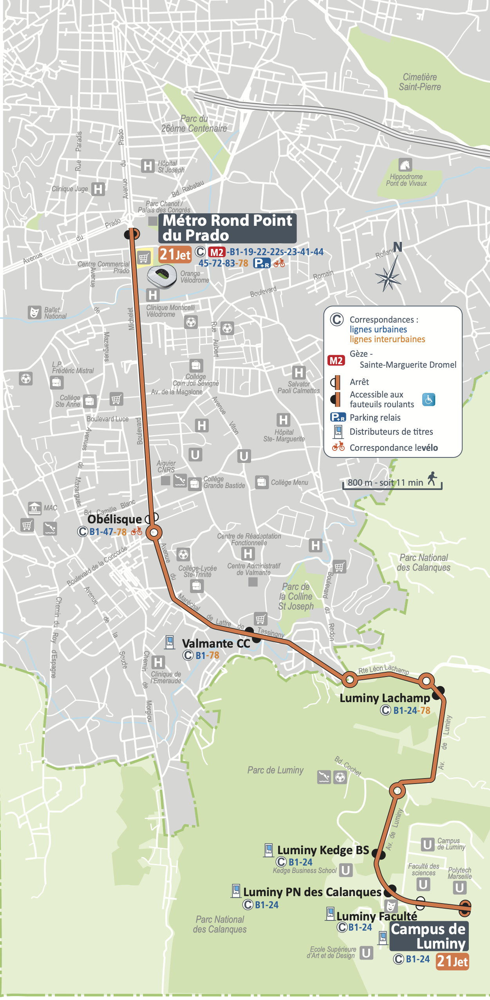
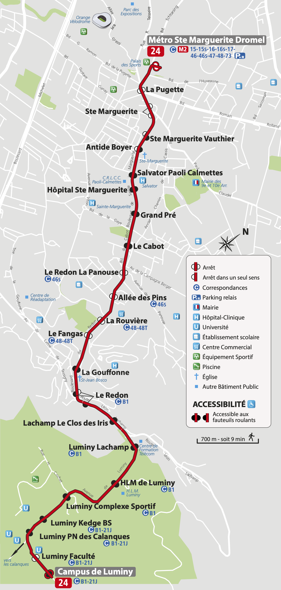
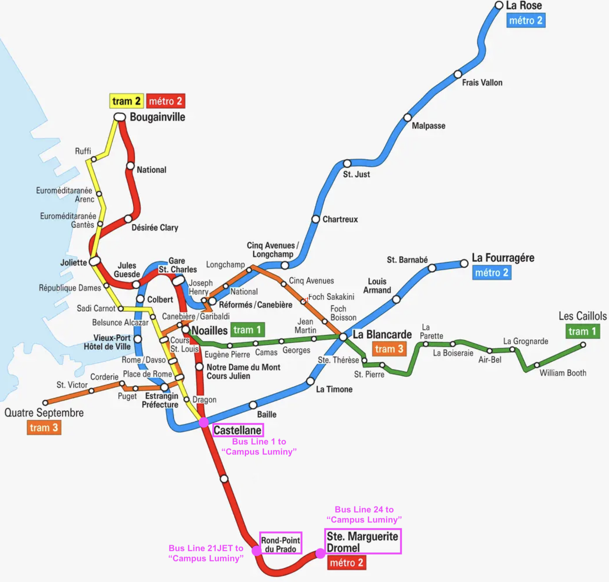

<html>

<body>

<h1>Workshop venue </h1>
  
The workshop will be held in the Campus Luminy of Aix-Marseille University, in the middle of the "Calanques" Natural Parc. The campus is 1 hour in public transport from the central train and bus stations (Gare Saint Charles), and 46 minutes from the old port in the city center (Vieux Port). A combination of Metro and Bus might be required to reach the campus (see more details below). 

<!--<iframe width="425" height="350" src="https://www.openstreetmap.org/export/embed.html?bbox=5.4332971572875985%2C43.22669354534018%2C5.448746681213379%2C43.232298479847344&amp;layer=mapnik&amp;marker=43.22949216841962%2C5.441021919250488" style="border: 1px solid black"></iframe> <small><a href="https://www.openstreetmap.org/?mlat=43.22949&amp;mlon=5.44102#map=17/43.22950/5.44102">View Larger Map</a></small>-->

<h1>Bus stop: LUMINY FACULTÉ (recommended, penultimate stop)</h1>

<h2>DAY 1 (18/11/24): C.I.N.a.M. BUILDING </h2>
<iframe src="https://www.google.com/maps/embed?pb=!1m26!1m12!1m3!1d6018.1267694555145!2d5.437617269160283!3d43.2332107869832!2m3!1f0!2f0!3f0!3m2!1i1024!2i768!4f13.1!4m11!3e2!4m3!3m2!1d43.234180099999996!2d5.4398005!4m5!1s0x12c9b9adb9d80701%3A0xaffeebbe6913e272!2sLuminy%20Facult%C3%A9%2C%2013009%20Marseille!3m2!1d43.2311656!2d5.4395758999999995!5e1!3m2!1sen!2sfr!4v1731586291742!5m2!1sen!2sfr" width="600" height="450" style="border:0;" allowfullscreen="" loading="lazy" referrerpolicy="no-referrer-when-downgrade"></iframe>

<h2>DAY 2 (19/11/24) AND DAY 3 (20/11/24): HEXAGONE BUILDING </h2>
<iframe src="https://www.google.com/maps/embed?pb=!1m35!1m12!1m3!1d1904.4727782625325!2d5.4399231991146095!3d43.22993579409925!2m3!1f0!2f0!3f0!3m2!1i1024!2i768!4f13.1!4m20!3e2!4m5!1s0x12c9b949649eeacd%3A0xc98f7dc0b48b1d39!2sHexagone%20Amphitheatre%2C%20Avenue%20de%20Luminy%2C%20Marseille!3m2!1d43.2296823!2d5.44086!4m3!3m2!1d43.2306521!2d5.4401082!4m3!3m2!1d43.230816!2d5.4399253!4m4!1s0x12c9b9adc793e17f%3A0x559866f133c2145f!3m2!1d43.23106!2d5.439839999999999!5e1!3m2!1sfr!2sfr!4v1731586894373!5m2!1sfr!2sfr" width="600" height="450" style="border:0;" allowfullscreen="" loading="lazy" referrerpolicy="no-referrer-when-downgrade"></iframe>

<h1>Bus stop: CAMPUS DE LUMINY (last stop)</h1>

<h2>DAY 1 (18/11/24): C.I.N.a.M. BUILDING </h2>
<iframe src="https://www.google.com/maps/embed?pb=!1m26!1m12!1m3!1d4118.076150026536!2d5.439592989335912!3d43.23303251648354!2m3!1f0!2f0!3f0!3m2!1i1024!2i768!4f13.1!4m11!3e2!4m3!3m2!1d43.2342844!2d5.4398082!4m5!1s0x12c9b9afab382443%3A0x49c1db8461762e1a!2sCampus%20de%20Luminy%2C%2013009%20Marseille!3m2!1d43.23124!2d5.44401!5e1!3m2!1sfr!2sfr!4v1731584549438!5m2!1sfr!2sfr" width="600" height="450" style="border:0;" allowfullscreen="" loading="lazy" referrerpolicy="no-referrer-when-downgrade"></iframe>

<h1>DAY 2 (19/11/24) AND DAY 3 (20/11/24): HEXAGONE BUILDING </h1>
<iframe src="https://www.google.com/maps/embed?pb=!1m26!1m12!1m3!1d2135.2239333400134!2d5.440933666497054!3d43.23013410496164!2m3!1f0!2f0!3f0!3m2!1i1024!2i768!4f13.1!4m11!3e2!4m5!1s0x12c9b949649eeacd%3A0xc98f7dc0b48b1d39!2sHexagone%20Amphitheatre%2C%20Avenue%20de%20Luminy%2C%20Marseille!3m2!1d43.2296823!2d5.44086!4m3!3m2!1d43.231180099999996!2d5.443575399999999!5e1!3m2!1sfr!2sfr!4v1731586953765!5m2!1sfr!2sfr" width="600" height="450" style="border:0;" allowfullscreen="" loading="lazy" referrerpolicy="no-referrer-when-downgrade"></iframe>

<h1>City public transportation</h1>

The bus lines <b>21JET</b> (depart from Métro 2 Rond Point du Prado), <b>B1</b> (depart from Métro 1&2 Castellane) and <b>24</b> (depart from Métro 2 Sainte Marguerite Dromel) can bring you to Luminy Campus (last stop). For more information on the public transports in Marseille and prices, visit the official website: 
<a href="https://www.rtm.fr/en" target="_bulk">https://www.rtm.fr</a> 

Bus lines to Campus Luminy: 
<table><thead>
  <th>21JET   (fastest, departure Metro 2 Rond Point du Prado)</th> <th>B1    (departure Metro 1&2 Castellane)</th> <th>24    (departure Metro 2 St. Marguerite Dromel)</th>
</thead>
<tbody>
  <tr>
    <td></td>
    <td></td>
    <td></td>    
  </tr>
</tbody>
</table>

Departure from Metro Castellane: 
<iframe src="https://www.google.com/maps/embed?pb=!1m28!1m12!1m3!1d51494.536665251086!2d5.398758201957438!3d43.2590797578856!2m3!1f0!2f0!3f0!3m2!1i1024!2i768!4f13.1!4m13!3e3!4m5!1s0x12c9c0ae109c26bf%3A0xfc92f2dae6c6718f!2sM%C3%A9tro%20Castellane%2C%20Place%20Castellane%2C%20Marseille!3m2!1d43.285923!2d5.3837329!4m5!1s0x12c9b9ac4de888d7%3A0x35aa62955b153ea2!2sHexagone%2C%20172%20Av.%20de%20Luminy%2C%2013009%20Marseille!3m2!1d43.229480599999995!2d5.4410666999999995!5e1!3m2!1sfr!2sfr!4v1720178460621!5m2!1sfr!2sfr" width="600" height="450" style="border:0;" allowfullscreen="" loading="lazy" referrerpolicy="no-referrer-when-downgrade"></iframe>  

Departure from Metro Rond-Point du Prado: 
<iframe src="https://www.google.com/maps/embed?pb=!1m28!1m12!1m3!1d23369.450250613525!2d5.3961122652555025!3d43.250465544200914!2m3!1f0!2f0!3f0!3m2!1i1024!2i768!4f13.1!4m13!3e3!4m5!1s0x12c9c757bfdca9f9%3A0x227bc075dd56bf8e!2sRond%20Point%20du%20Prado%2C%20Marseille!3m2!1d43.2714542!2d5.3923767!4m5!1s0x12c9b9ac4de888d7%3A0x35aa62955b153ea2!2sHexagone%2C%20172%20Av.%20de%20Luminy%2C%2013009%20Marseille!3m2!1d43.229480599999995!2d5.4410666999999995!5e1!3m2!1sfr!2sfr!4v1720178541168!5m2!1sfr!2sfr" width="600" height="450" style="border:0;" allowfullscreen="" loading="lazy" referrerpolicy="no-referrer-when-downgrade"></iframe>  

Departure from Metro Old Port (Vieux Port):
<iframe src="https://www.google.com/maps/embed?pb=!1m28!1m12!1m3!1d46728.887570947!2d5.366193773070285!3d43.263511976450616!2m3!1f0!2f0!3f0!3m2!1i1024!2i768!4f13.1!4m13!3e3!4m5!1s0x12c9c0bf4842929f%3A0x15e350ebed4fdd30!2sVieux%20Port%2C%20Marseille!3m2!1d43.2949963!2d5.3739294!4m5!1s0x12c9b9ac4de888d7%3A0x35aa62955b153ea2!2sHexagone%2C%20172%20Av.%20de%20Luminy%2C%2013009%20Marseille!3m2!1d43.229480599999995!2d5.4410666999999995!5e1!3m2!1sfr!2sfr!4v1720178648539!5m2!1sfr!2sfr" width="600" height="450" style="border:0;" allowfullscreen="" loading="lazy" referrerpolicy="no-referrer-when-downgrade"></iframe>  

Departure from Metro Saint Charles (train station):
<iframe src="https://www.google.com/maps/embed?pb=!1m28!1m12!1m3!1d46726.946515039235!2d5.369327823104709!3d43.2660407264109!2m3!1f0!2f0!3f0!3m2!1i1024!2i768!4f13.1!4m13!3e3!4m5!1s0x12c9c096f7362eb5%3A0x9be0c4919b550fa0!2sSaint%20Charles%2C%20Marseille!3m2!1d43.3026157!2d5.3802848!4m5!1s0x12c9b9ac4de888d7%3A0x35aa62955b153ea2!2sHexagone%2C%20172%20Av.%20de%20Luminy%2C%2013009%20Marseille!3m2!1d43.229480599999995!2d5.4410666999999995!5e1!3m2!1sfr!2sfr!4v1720178705268!5m2!1sfr!2sfr" width="600" height="450" style="border:0;" allowfullscreen="" loading="lazy" referrerpolicy="no-referrer-when-downgrade"></iframe>  

Metro lines: 

<h1>Airport Bus (Navette Aéroport) </h1>

Public transportation from the airport directly to the Gare Saint Charles bus station is available. Take bus line 91. More information can be found here: <a href="https://www.marseille-airport.com/access-car-parks/access/bus/marseille-st-charles-station" target="_blank">https://www.marseille-airport.com</a>

<h1>Hotels nearby the city center </h1>
<ul>
    <li>AC Hotel Marseille Prado Velodrome - Rond Point du Prado - <a href="https://www.marriott.com/en-us/hotels/mrsar-ac-hotel-marseille-prado-velodrome/overview/?scid=f2ae0541-1279-4f24-b197-a979c79310b0" target="_blank"> Website </a></li>
      <li>Mercure Marseille Centre Prado Velodrome - Rond Point du Prado - <a href="https://all.accor.com/hotel/3004/index.en.shtml" target="_blank"> Website </a></li>
        <li>Hotel Raphaël Prado - Rond Point du Prado - <a href="https://hotelraphaelprado.la-fr.com/en/" target="_blank"> Website </a></li>
        <li> ibis Styles Marseille Centre - Castellane - <a href="https://all.accor.com/hotel/7974/index.en.shtml" target="_blank"> Website </a></li>
        <li> Novotel Marseille Centre Prado - Castellane - <a href="https://all.accor.com/hotel/9013/index.en.shtml" target="_blank"> Website </a></li>
  <li>Holiday Inn Express Marseille - Saint Charles - <a href="https://www.ihg.com/holidayinnexpress/hotels/fr/fr/marseille/mrssc/hoteldetail" target="_blank"> Website </a></li>
  <li>Ibis Styles Marseille Gare Saint-Charles - <a href="https://all.accor.com/hotel/A1J8/index.en.shtml" target="_blank"> Website </a></li>
    <li>Hôtel Mercure Marseille Centre Vieux Port - <a href="https://all.accor.com/hotel/1148/index.en.shtml" target="_blank"> Website </a></li>
      <li>Hôtel Mercure Marseille Canebière Vieux-Port - <a href="https://all.accor.com/hotel/A0D3/index.en.shtml" target="_blank"> Website </a></li>
        <li>Hôtel NH Collection - <a href="https://www.nh-hotels.com/en/hotel/nh-collection-marseille" target="_blank"> Website </a></li>
     <li>New Hotel Le Quai - Vieux Port
 - <a href="https://www.new-hotel.com/fr/hotels-marseille/le-quai-vieux-port" target="_blank"> Website </a></li>
</ul>

<h1>Tourism </h1>

The official website of Marseille tourism provides all information for visiting Marseille and suroundings: 
<a href="https://www.marseille-tourisme.com/en/" target="_blank"> https://www.marseille-tourisme.com/</a> 

</body>
</html>
